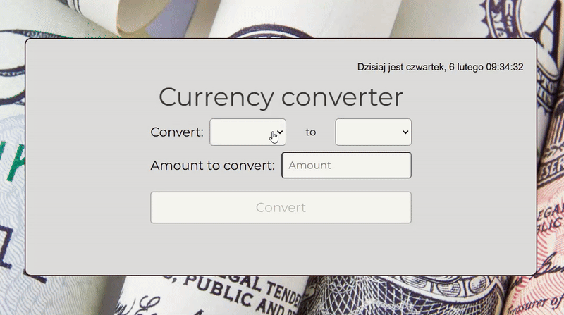

# Currency converter

## Description:

This is a user-friendly currency converter that allows you to convert between a wide range of global currencies. The application fetches exchange rates from [CurrencyAPI](https://currencyapi.com), which updates its data every 60 seconds, ensuring accurate and timely conversions.

### Features:
- **Wide Currency Support**: Convert between numerous global currencies.
- **Accurate Data**: Exchange rates are updated every 60 seconds, providing reliable conversions.
- **Simple Interface**: An intuitive design for quick and easy currency conversion.

### How to Use:
1. Select the currency you want to convert from.
2. Choose the currency you want to convert to.
3. Enter the amount you wish to convert.
4. Click the "Convert" button to see the result.  
  

## Demo:
Check my demo [here](https://mikoli09.github.io/CurrencyConverter-with-React/)

## Technologies used
- **HTML** - Provides website structure.
- **JavaScript** - Adds interactivity and dynamic behavior to the website.
- **Styled-components** - Modular and scoped styling, improving code organization and maintainability.
- **React** - JavaScript library for building user interfaces with components.
- **Create React App** - A tool that sets up a React project with everything you need to start.
- **Webpack** - Bundles JavaScript, CSS, and assets for optimized performance.  
- **Custom hooks** - Manages state and reusable logic, making the code cleaner and easier to maintain.
- **Axios** - A JavaScript library for easily fetching data from APIs.

## Available Scripts

In the project directory, you can run:

### `npm start`

Runs the app in the development mode.\
Open [http://localhost:3000](http://localhost:3000) to view it in your browser.

The page will reload when you make changes.\
You may also see any lint errors in the console.

### `npm run build`

Builds the app for production to the `build` folder.\
It correctly bundles React in production mode and optimizes the build for the best performance.

The build is minified and the filenames include the hashes.\
Your app is ready to be deployed!

See the section about [deployment](https://facebook.github.io/create-react-app/docs/deployment) for more information.

### `npm run eject`

**Note: this is a one-way operation. Once you `eject`, you can't go back!**

If you aren't satisfied with the build tool and configuration choices, you can `eject` at any time. This command will remove the single build dependency from your project.

Instead, it will copy all the configuration files and the transitive dependencies (webpack, Babel, ESLint, etc) right into your project so you have full control over them. All of the commands except `eject` will still work, but they will point to the copied scripts so you can tweak them. At this point you're on your own.

You don't have to ever use `eject`. The curated feature set is suitable for small and middle deployments, and you shouldn't feel obligated to use this feature. However we understand that this tool wouldn't be useful if you couldn't customize it when you are ready for it.

## Contact:

Feel free to contact me: 

**E-mail:** [osojca.marcin1@gmail.com](mailto:osojca.marcin1@gmail.com)
